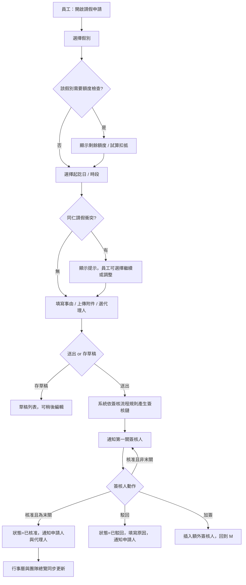
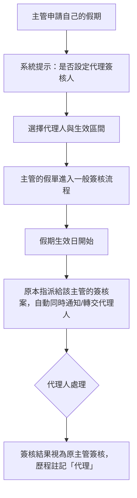
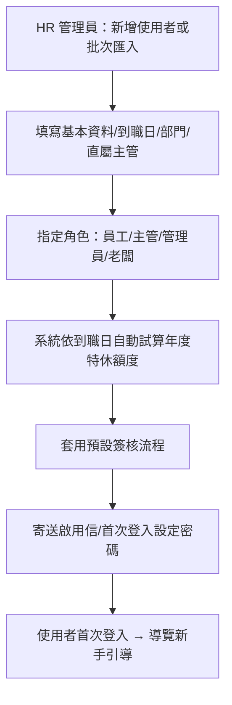
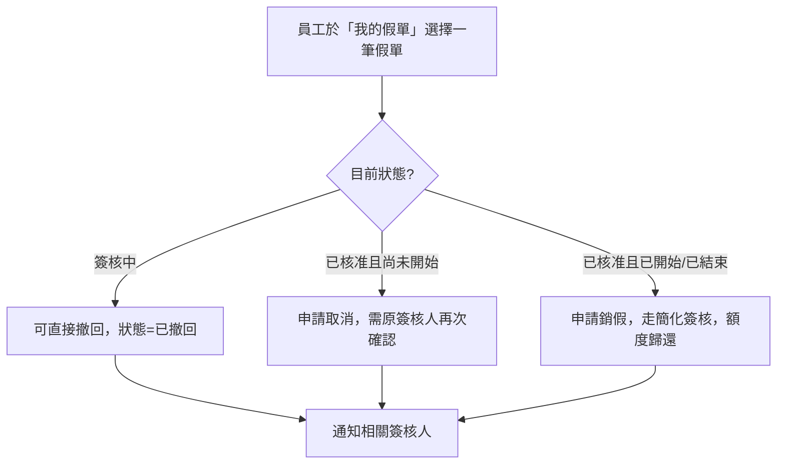
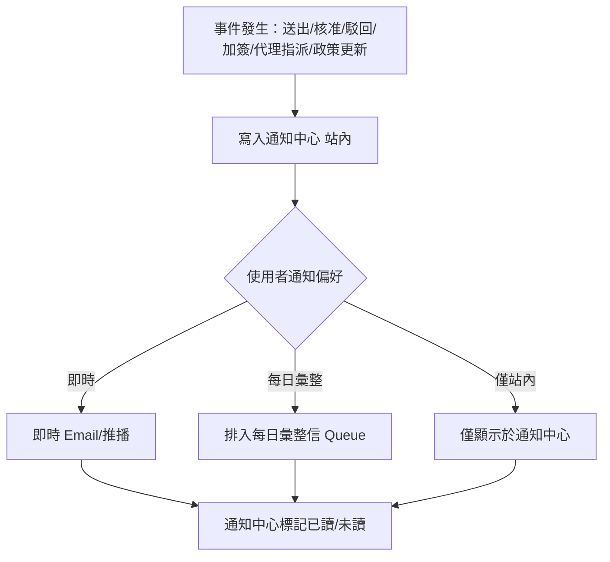
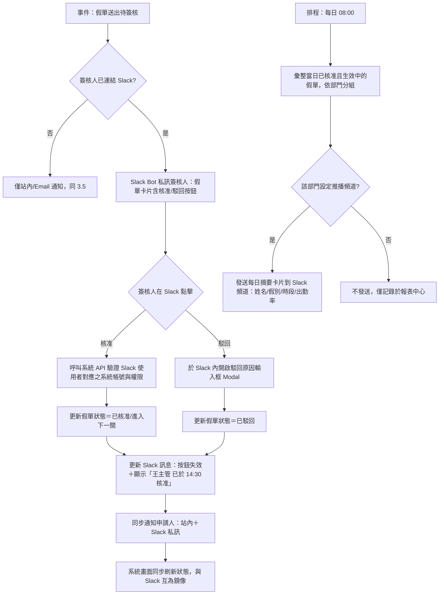
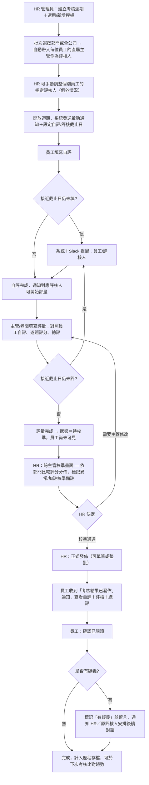

# 企業級請假管理系統（Leave Management System）— Phase 1 基礎架構設計

> 範疇：Web Responsive・Desktop First・Mobile Friendly・深色模式・多語系・Material Design 3・WCAG AA・適用 1000 人以上企業
> 本階段交付：Functional Analysis／User Story／User Flow／IA。**尚未進入畫面設計**，待架構確認後再進行 Phase 2（逐畫面設計）與 Phase 3（Design System）。

---

## 0. 設計原則

1. **Desktop First，Mobile Friendly**：核心操作（簽核、排班檢視、報表）在桌機需支援高資訊密度；手機需保證「請假申請」「簽核」「查看行事曆」三件事單手可完成。
2. **角色即體驗（Role-based UX）**：同一帳號常身兼多重身分（例如「主管」同時也是「員工」要請自己的假），介面需清楚切換情境而非用兩套系統。
3. **規模化（Scale for 1000+ 員工）**：列表需分頁／虛擬捲動、需要全域搜尋、需要通知摘要化，避免資訊過載。
4. **無障礙優先**：不是最後補測，而是從 IA、色彩對比、鍵盤操作路徑就納入設計（WCAG 2.1 AA）。
5. **可治理（Governance）**：假別規則、簽核流程、假期額度都是「設定」而非寫死在程式碼，管理員可自助調整以符合勞基法及公司政策異動。

---

## 1. Functional Analysis（功能分析）

### 1.1 現況功能盤點

以現有系統（React + Supabase）盤點出的既有能力：

| 模組 | 現況功能 |
|---|---|
| 身分與角色 | 員工 / 副主管 / 主管 / 管理員 / 老闆，五種角色寫死於 `role` 欄位 |
| 請假申請 | 假別選擇、起訖日、半天時段、代理人、事由、附件（無） |
| 我的假單 | 列表、狀態、編輯/取消 |
| 簽核 | 簽核佇列、多層 flow（`approval_flow_steps`）、代理簽核（`approval_delegates`） |
| 行事曆 | 團隊請假總覽（月曆） |
| 過往假期 | 歷史查詢 |
| 年度考核 | 自評 + 單一指定評核人（`supervisor_id`）雙方考核；僅 `boss` 角色能建立考核週期/模板/參與者名單，`admin`（HR）反而無管理權限；參與者需一人一人手動加入；評核人送出後員工立即可見結果，中間無 HR 校準/發佈把關步驟（獨立子系統） |
| 匯出報表 | Excel/CSV 匯出 |
| 管理後台 | 使用者管理、假別設定、簽核流程設定 |
| 個人資料管理 | 僅有「修改密碼」，且誤放在「管理後台」分頁下；無姓名/Email/部門/頭像編輯、無語言切換、無通知偏好設定（因系統本身也無深色模式與多語系） |
| 導覽 | 單一頂部橫向 Nav Bar，所有項目對所有可見角色攤平顯示 |
| Slack 整合 | 無（僅站內通知，需新增） |

### 1.2 企業級落差分析（Gap Analysis，1000 人規模）

| 面向 | 現況風險 | 對策方向 |
|---|---|---|
| 導覽架構 | 橫向 Nav 隨功能增加會塞爆，且無法承載搜尋/通知/語言/主題切換 | 改為 **Navigation Rail/Drawer + 頂部 App Bar**（見 IA 4.2） |
| 通知 | 僅首頁待辦紅點，無通知中心、無 Email/摘要 | 新增「通知中心」+ 通知偏好設定 |
| 搜尋 | 無全域搜尋 | 新增全域搜尋（找人、找假單編號、找政策） |
| 假別規則 | 額度規則隱含在後端，UI 未呈現計算邏輯 | 「假期規則」透明化頁面 + 額度試算 |
| 大量資料 | 列表為一次全量載入 | 分頁 + 虛擬捲動 + 篩選 |
| 多語系 | 全繁體中文寫死 | i18n key 化，日期/數字/假別名稱在地化 |
| 深色模式 | 無 | Design Token 化色彩系統 |
| 無障礙 | 純樣式無 aria、色彩對比未檢核 | WCAG AA 檢核（見色彩章節） |
| 代理人/職務代理 | 有資料表，但無「請假期間自動生效」提示與衝突偵測 | OOO（Out of Office）自動化 + 衝突提示 |
| 稽核 | 簽核歷程無完整 Audit Trail 呈現 | 「簽核歷程時間軸」頁面元件 |
| SSO | 僅 Email/密碼 | 預留企業 SSO（SAML/OAuth）登入選項 |
| Slack 依賴 | 團隊多用 Slack 溝通，簽核與請假提醒卻只能靠打開網頁才會知道 | 導入 **Slack 整合**：簽核可直接在 Slack 核准/駁回、每日團隊請假摘要推播到頻道 |
| 個人資料管理 | 只有改密碼，且藏在「管理後台」下（一般員工點「管理後台」卻只看到改密碼表單，語意錯置）；姓名/部門異動需靠 HR 到使用者管理後台代改，員工無法自行維護 | 獨立出「個人設定」（`/settings/*`，見 IA 4.1／4.4），與管理後台脫鉤；納入個人資料、外觀（語言/深色模式）、通知偏好三個分頁（見 Phase 2 B16） |
| 角色重疊 | 「副主管」為固定角色，但其實際用途（主管不在時代為處理簽核）與「職務代理」（`approval_delegates`）功能重疊，兩套機制並存造成混淆（該找副主管簽核，還是等代理設定生效？） | **移除「副主管」角色**，簡化為員工／主管／管理員／老闆四種；原本副主管的代理職能完全由「代理簽核設定」（B9）承接，一套機制、一個心智模型 |
| 年度考核治理 | 僅 `boss` 能建立考核週期與參與者，`admin`（HR）反而無權限，1000+ 人規模下老闆本人手動逐一加入參與者不可行；評核人送出評量後結果立即對員工可見，無跨主管評分校準、無正式「發佈」與員工「已讀確認」步驟 | 詳見下方 Epic H 與流程圖 3.7：考核治理權下放至 `admin`（HR），新增批次加入參與者、跨團隊校準、正式發佈、員工確認閱讀等步驟 |
| 使用者資料模型 | 使用者資料表目前**沒有「直屬主管」欄位**（無 `manager_id` 或等義關聯），組織架構只能從「簽核流程指派」間接猜測，且簽核指派的對象是「流程節點」而非「這個人的主管」，兩者語意不同、不能互相替代。這是 Epic H「批次加入參與者並自動帶出直屬主管作為評核人」（3.7）能否成立的先決條件 | 於使用者資料表新增 `manager_id`（指向使用者本身，形成組織樹），由 HR 於新增/編輯使用者（B13）時維護；補上前，年度考核批次建立參與者時「評核人」仍須逐人手動指定，無法自動帶入 |

### 1.3 功能模組清單（MoSCoW）

**Must Have（Phase 1-2 必備）**
- 登入／忘記密碼／SSO 入口
- 請假申請（含假別規則試算、附件、代理人、衝突提示）
- 我的假單（列表、詳情、取消/銷假、編輯草稿）
- 簽核中心（待簽、已簽、加簽、退回、代理簽核）
- 團隊/部門行事曆
- 儀表板（個人假期總覽、待辦、公告）
- 通知中心
- 管理後台：使用者、假別、簽核流程、假日行事曆
- 全域搜尋、語言切換、深色模式切換
- **報表中心**（假別統計、部門出勤率、特休未休提醒／匯出）
- **個人設定**（獨立於管理後台）：個人資料編輯、外觀（語言/深色模式）、通知偏好，取代現況誤放在管理後台下的「修改密碼」
- **Slack 整合**：簽核卡片（核准/駁回可直接在 Slack 完成）＋ 每日團隊請假摘要頻道推播

**Should Have**
- 職務代理管理（休假自動轉交）
- 稽核／簽核歷程時間軸
- 通知偏好設定（Email digest）
- **假期規則試算器**（HR 端，管理後台假別設定內的即時預覽工具，見 Phase 2 B14）：與員工申請當下看到的「剩餘額度顯示」不同，這是給 HR 儲存規則前驗證用的輔助工具，非必備但建議儘早排入
- **年度考核流程改版**（見 Epic H／流程圖 3.7）：治理權下放至 HR、批次加入參與者、跨主管校準、正式發佈、員工確認閱讀

**Could Have**
- 行動裝置推播、Teams 整合（架構比照 Slack 整合抽象化，未來可平行擴充）
- 假期額度模擬器（試算離職結算）

**Won't Have（本階段不做）**
- 排班/打卡整合（另屬 Time & Attendance 系統範疇）
- 薪資試算

---

## 2. User Stories

### Epic A：帳號與導覽
- 作為**任何使用者**，我希望登入後能立即看到「我今天/本週的假期狀態與待辦」，以便快速掌握狀況。
- 作為**任何使用者**，我希望能切換語言與深色模式，且設定會被記住，以便長時間使用時視覺舒適。
- 作為**任何使用者**，我希望能用鍵盤與螢幕閱讀器完整操作系統，以便符合公司無障礙政策。
- 作為**視力不便的員工**，我希望所有互動元件的對比與焦點樣式清楚可辨識，以便獨立完成請假申請。

### Epic B：請假申請（員工）
- 作為**員工**，我希望在申請前就看到「這個假別還剩幾天/幾小時」，以避免申請超額被打回。
- 作為**員工**，我希望選擇日期時，系統提示「同部門已有 N 人在這天請假」，以便自行評估是否調整。
- 作為**員工**，我希望能上傳病假證明等附件，以符合公司規範。
- 作為**員工**，我希望能指定代理人並讓對方收到通知，以便交接工作。
- 作為**員工**，我希望能儲存草稿，稍後再送出。
- 作為**員工**，我希望送出後能看到目前卡在哪一關簽核、預計何時處理，以減少「已讀不回」焦慮。
- 作為**員工**，我希望能在簽核通過前撤回申請、或在通過後申請銷假，以應對計畫變動。

### Epic C：簽核（主管／老闆）
- 作為**主管**，我希望簽核佇列可依「急迫程度／申請日期／假別」排序與篩選，以便優先處理即將開始的假單。
- 作為**主管**，我希望可以在單一畫面批次核准多筆低風險假單（如半天特休），以節省時間。
- 作為**主管**，我希望駁回時必須填寫原因，讓員工清楚後續行動。
- 作為**即將休假的主管**，我希望設定「代理簽核人」與生效區間，讓簽核不中斷。
- 作為**主管**，我希望查看某位員工的歷史請假紀錄與團隊行事曆，以判斷是否核准。

### Epic D：管理員／HR
- 作為**HR 管理員**，我希望在後台設定假別的計算規則（年資比例、遞延上限、是否需附件），不需要工程師介入。
- 作為**HR 管理員**，我希望設計簽核流程（依假別/天數/部門分流），並能對既有流程做版本管理。
- 作為**HR 管理員**，我希望建立/停用帳號、批次匯入新進員工，以應對 1000+ 人規模的異動量。
- 作為**HR 管理員**，我希望匯出符合勞基法要求的特休未休報表，以完成法遵作業。
- 作為**HR 管理員**，我希望設定公司行事曆（國定假日、颱風假），全公司行事曆自動套用。

### Epic E：高階主管／老闆
- 作為**老闆**，我希望看到全公司/各部門的出勤與請假總覽儀表板，掌握人力狀況。
- 作為**老闆**，我希望我的簽核待辦與一般主管一致，但能一鍵下鑽到部門明細。

### Epic F：通知
- 作為**任何使用者**，我希望有一個通知中心彙整「待簽核」「簽核結果」「代理人指派」「政策更新」，而不是只有紅點。
- 作為**使用者**，我希望能設定「每日彙整信」而非每筆都收信，以避免信箱轟炸。

### Epic G：Slack 整合
- 作為**主管**，我希望待簽核假單能直接推播到 Slack 私訊，並在訊息上直接點「核准／駁回」，不需要另外打開系統網頁。
- 作為**主管**，我希望在 Slack 上完成核准/駁回後，系統與 Slack 訊息狀態同步更新（訊息會顯示「已由誰於何時處理」，按鈕隨即失效），避免重複處理或狀態不一致。
- 作為**員工**，我希望自己假單的核准/駁回結果除了站內通知，也能同步收到 Slack 私訊，跟我原本的工作習慣一致。
- 作為**團隊成員**，我希望每天固定時間在指定 Slack 頻道收到「今天誰請假」摘要（含部門、假別、是否請半天），不需要另外打開行事曆確認找不到人的原因。
- 作為**HR 管理員**，我希望在管理後台設定要連接的 Slack Workspace、指定每日摘要要發到哪個頻道、以及哪些事件要走 Slack 通知，不需要工程介入。
- 作為**使用者**，我希望能自行選擇是否啟用 Slack 通知（例如沒有使用 Slack 的部門可關閉），不被強制綁定。
- 作為**HR 管理員**，我希望 Slack 授權過期或連線中斷時能在後台清楚看到警示並重新授權，避免簽核通知悄悄停止而不自知。

### Epic H：年度考核流程改版
- 作為**HR 管理員**，我希望能自己建立/管理考核週期、模板與參與者名單，不需要每次都找老闆操作（現況只有 `boss` 角色能管理，HR 反而無權限）。
- 作為**HR 管理員**，我希望能依部門/全公司「批次」把員工加入考核週期並自動帶入其直屬主管作為評核人，不需要 1000+ 人逐一手動加入。
- 作為**HR 管理員**，我希望在評核人送出考核後，能先看到跨主管的評分分佈做校準，避免有些主管評分過鬆、有些過嚴而不自知。
- 作為**HR 管理員**，我希望校準後才「正式發佈」結果給員工，而不是評核人一送出員工就立刻看到（現況少了把關步驟）。
- 作為**員工**，我希望在收到考核結果後有明確的「確認已閱讀」動作，若對結果有疑義能直接標記提出，而不是看完就沒有下文。
- 作為**主管**，我希望考核截止日前能收到提醒（含 Slack），不要卡到最後一刻才發現忘記填。

驗收條件範例（以「請假申請」故事為例）：
- Given 員工已登入 → When 選擇假別 → Then 顯示該假別「剩餘額度」與「本次扣抵天數試算」。
- Given 選擇日期區間與同部門其他請假重疊 → Then 顯示非阻斷式警示（可繼續送出）。
- Given 送出成功 → Then 進入「我的假單」列表狀態為「簽核中」，並顯示目前簽核關卡。

---

## 3. User Flow

### 3.1 請假申請與簽核主流程



### 3.2 主管請假期間的代理簽核



### 3.3 新進員工建立與角色指派（HR/Admin）



### 3.4 假單取消／銷假流程



### 3.5 通知與提醒機制



### 3.6 Slack 簽核與每日團隊摘要



**設計要點**：
- Slack 內操作與系統網頁操作視為同一份資料的兩個入口，任一邊完成後另一邊須即時反映（避免「Slack 顯示待處理、網頁顯示已核准」的不一致）。
- 駁回在 Slack 上仍強制要求填寫原因（透過 Slack Modal），維持與網頁一致的資料完整性要求（見 Epic C）。
- 每日摘要以「部門」為發送單位，避免所有假期都塞進單一全公司頻道造成雜訊；管理員可在整合設定中為不同部門指定不同頻道。
- Slack 帳號與系統帳號的對應透過 Slack OAuth 建立，非以姓名字串比對，避免同名/離職帳號誤判。

### 3.7 年度考核改版流程

現況（見 1.2 落差分析）：只有 `boss` 能建立考核週期／參與者，評核人一送出評量員工就立即看到結果，中間沒有任何校準或把關步驟。改版重點：**治理權下放給 HR（`admin`）、批次建立參與者、送出結果前加入跨主管校準、正式發佈與員工確認閱讀**，並讓老闆從「唯一管理者」退回「其中一種評核角色＋全公司唯讀總覽」。



**設計要點**：
- 「待校準」是新增的中間狀態，員工在此狀態下看不到任何評核內容，避免評核人筆誤或未經校準的分數提早外流造成困擾。
- 校準畫面只給 HR 標記／加註，不直接覆寫評核人給的分數，維持評核責任歸屬清楚；若真的需要改分，退回給原評核人重新提交。
- 批次建立參與者時，「直屬主管」需要有資料來源（現況使用者資料尚無明確的 `manager_id` 欄位，僅有簽核流程指派），此為後續資料模型需要一併補上的欄位，否則批次自動帶入評核人無法運作。
- 截止日提醒沿用 3.6 的 Slack 通知機制，不另開一套提醒邏輯。
- 老闆角色不再是唯一能管理考核的人，僅在「自己是某人的直屬主管」時才出現在評核佇列，並保留全公司唯讀總覽（呼應角色矩陣 4.3）。

---

## 4. Information Architecture（IA）

### 4.1 Sitemap

```
├── 登入 / SSO / 忘記密碼
└── 應用程式（已登入）
    ├── 儀表板 Dashboard（首頁）
    ├── 請假
    │   ├── 申請請假
    │   ├── 我的假單（進行中／草稿）
    │   └── 過往假期（歷史）
    ├── 團隊
    │   ├── 部門行事曆
    │   └── 團隊總覽（主管以上可見人力覆蓋率）
    ├── 簽核中心（主管／老闆／管理員可見）
    │   ├── 待簽核
    │   ├── 已處理
    │   └── 代理簽核設定
    ├── 報表中心
    │   ├── 假別統計
    │   ├── 部門出勤
    │   └── 匯出紀錄
    ├── 年度考核（改版，見 Epic H／流程 3.7）
    │   ├── 我的考核（自評／查看結果）
    │   ├── 評核填寫（主管/老闆）
    │   └── 考核治理（HR：週期／參與者／校準／發佈）
    ├── 通知中心
    ├── 管理後台（管理員／老闆）
    │   ├── 使用者管理
    │   ├── 假別與規則設定
    │   ├── 簽核流程設計器
    │   ├── 公司行事曆（國定假日）
    │   ├── Slack 整合設定（連接 Workspace／事件對應頻道）
    │   └── 系統設定（語言預設、通知規則、品牌）
    └── 個人設定
        ├── 個人資料
        ├── 語言 / 深色模式
        └── 通知偏好（含「同步至 Slack」開關與帳號連結狀態）
```

### 4.2 導覽模型：從 Top Nav 改為 Navigation Rail + App Bar

**決策**：現況橫向頂部選單在 1000 人規模、模組增加後會超出可視寬度且無法容納搜尋列、通知鈴鐺、語言切換、主題切換與使用者選單。改採 Material Design 3 建議的雙層結構：

- **左側 Navigation Rail（桌面預設收合窄軌，可展開為 Drawer）**：放置一級模組（儀表板／請假／團隊／簽核中心／報表／年度考核／管理後台）。
- **頂部 App Bar（全域）**：全域搜尋、通知鈴鐺（含未讀數）、語言切換、深色模式切換、使用者選單（個人設定/登出）。
- **手機版**：Rail 收為底部 Bottom Navigation（4 個最高頻項目：儀表板／申請請假／我的假單／通知）＋ 「更多」進入其餘模組，其餘沿用 App Bar 精簡版。

**無障礙考量**：Rail/Drawer 需可用鍵盤 Tab/方向鍵操作、具備 `landmark role="navigation"`，並提供「跳到主要內容」Skip Link。

### 4.3 角色 × 導覽可見性矩陣

| 一級導覽項目 | 員工 | 主管 | 管理員 | 老闆 |
|---|:---:|:---:|:---:|:---:|
| 儀表板 | ✓ | ✓ | ✓ | ✓ |
| 請假（申請/我的假單/過往） | ✓ | ✓ | ✓ | ✓ |
| 團隊行事曆 | ✓（唯讀） | ✓ | ✓ | ✓ |
| 簽核中心 | – | ✓ | ✓ | ✓ |
| 報表中心 | – | 部門範圍 | 全公司範圍 | 全公司範圍 |
| 年度考核 | ✓（自評/查看） | ✓（評核+查看） | ✓（治理：週期/參與者/校準/發佈） | ✓（評核+全公司總覽） |
| 通知中心 | ✓ | ✓ | ✓ | ✓ |
| 管理後台 | – | – | ✓ | ✓（唯讀+關鍵設定） |
| Slack 整合設定 | – | – | ✓ | ✓ |

> 角色簡化說明：移除原「副主管」角色，其代理職能完全由「代理簽核設定」（B9）承接（見 1.2 落差分析）。四種角色為：員工／主管／管理員（HR）／老闆（高階主管，兼具全公司唯讀總覽與自己直屬下屬的簽核/評核權）。

> 註：一般使用者的 Slack 相關設定（是否啟用、連結個人 Slack 帳號）放在「個人設定 → 通知偏好」，不列入一級導覽，僅管理員可設定公司層級的 Workspace 連接與頻道對應。

> 註：同一使用者若同時具備多重情境（例如主管本身也要請假），介面不切換「角色模式」，而是同一組導覽下依權限顯示/隱藏對應項目，並在「請假」相關頁面永遠以「本人」身分呈現。

### 4.4 URL／頁面階層（供路由與麵包屑設計依據）

```
/login
/dashboard
/leaves/new
/leaves/mine
/leaves/history
/leaves/:id                     ← 假單詳情（簽核歷程時間軸）
/team/calendar
/team/overview
/approvals
/approvals/:id
/approvals/delegation
/reports
/reports/leave-summary
/reports/attendance
/reviews/mine                   ← 我的考核：自評／查看結果（員工）
/reviews/:cycleId/evaluate/:employeeId  ← 評核填寫（主管/老闆）
/admin/reviews/cycles           ← 考核週期與模板管理（HR）
/admin/reviews/cycles/:id/participants  ← 批次加入參與者／指定評核人（HR）
/admin/reviews/cycles/:id/calibration   ← 跨主管校準與發佈（HR）
/notifications
/admin/users
/admin/leave-types
/admin/approval-flows
/admin/company-calendar
/admin/integrations/slack        ← Slack Workspace 連接與頻道對應設定
/admin/settings
/settings/profile
/settings/appearance            ← 語言 / 深色模式
/settings/notifications
```

深層設定頁（如 `/admin/approval-flows/:id/edit`）一律搭配麵包屑（Breadcrumb）與「返回列表」，避免管理員在巢狀設定中迷路。

---

## 5. 架構決策確認結果

以下架構決策已與利害關係人確認：

1. **導覽**：由「橫向 Top Nav」改為「Navigation Rail（桌面）＋ Bottom Nav（手機）」— 採用。
2. **角色**：移除「副主管」，簡化為員工／主管／管理員／老闆四種；其代理職能由「代理簽核設定」（B9）承接（見 1.2、4.3）。
3. **必備模組**：「通知中心」「全域搜尋」「報表中心」列為 Must Have；「假期規則試算」（HR 端試算器，B14）**不**列入 Must Have，改列 Should Have（見 1.3 MoSCoW，與員工申請當下的即時餘額顯示為兩件事，後者仍是 Must Have 的一部分）。
4. **年度考核**：**不**僅做視覺統一，流程一併改版——治理權下放至 HR、批次建立參與者、新增跨主管校準與正式發佈、員工確認閱讀（見 Epic H、流程圖 3.7）。
5. **URL 結構**：可作為後續路由重構依據 — 採用。

Phase 1 架構確認完畢，將依序輸出 Phase 2（逐畫面設計，含 Dashboard／請假申請／我的假單／簽核中心／團隊行事曆／管理後台／年度考核等）與 Phase 3（Design Token／色彩／字型／Icon／間距／Grid／元件庫，已完成，見 `phase3-design-system.md`）。
